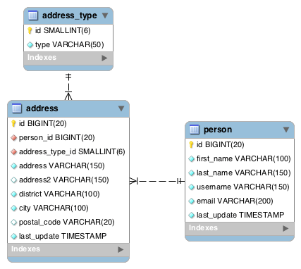

## graphql-presentation

- [Setup](#setup)
- [Start](#start)
- [Examples](#examples)
- [Queries](#queries)
  - [People info](#people-info)
  - [People with their home addresses](#people-with-their-home-addresses)
  - [Info about a single person](#info-about-a-single-person)
  - [Info for 2 specific people](#info-for-2-specific-people)
- [Programmatic queries](#programmatic-queries)
- [Mutations](#mutations)
  - [Add a new person with one address](#add-a-new-person-with-one-address)
  - [Update a person along with their address](#update-a-person-along-with-their-address)
  - [Delete a person along with their addresses](#delete-a-person-along-with-their-addresses)
- [Database ERD Diagram](#database-erd-diagram)

### Setup:
Note: Example 5 requires mysql

```shell
npm i 

# setup the db for example 5
mysql -u root -p<root-password> < ./5-with-database/scripts/db.sql
mysql -u root -p<root-password> < ./5-with-database/scripts/create-app-user.sql
```

### Start:
```shell
npm start
```

### Examples
0. Simple query example
1. Simple query example accepting an argument
2. Query with related types returned accepting an argument
3. An example of where DataLoader shines
4. Mutations
5. Above examples but executed against an actual database

### Queries 
You can use the [graphiql](http://localhost:3000/graphiql) end-point to issue queries.

### Example queries
#### People info:
```typescript
query {
  people {
    id
    firstName
    lastName
    username
    email
  }
}
```
#### People with their home addresses:
```typescript
query {
  people {
    id
    firstName
    lastName
    username
    email
    addresses(addressTypeId: home) {
      id
      addressTypeId
      address
      address2
      district
      city
      postalCode
    }
  }
}
```
#### Info about a single person:
```typescript
query {
  people(username:"cmoyers0") {
    id
    firstName
    lastName
    username
    email
    addresses {
      id
      addressTypeId
      address
      address2
      district
      city
      postalCode
    }
  }
}
```
#### Info for 2 specific people:
```typescript
query {
  colly: people(username: "cmoyers0") {
    id
    firstName
    lastName
    username
    email
    addresses(addressTypeId: work) {
      id
      addressTypeId
      address
      address2
      district
      city
      postalCode
    }
  }
  marget: people(username: "mpoone1") {
    id
    firstName
    lastName
    username
    email
    addresses(addressTypeId: home) {
      id
      addressTypeId
      address
      address2
      district
      city
      postalCode
    }
  }
}
```

### Programmatic queries:

Here's an example of sending a query to this API programmatically:
```javascript
'use strict';
/* eslint-disable no-console */

const requestPromise = require('request-promise');

const query = `query people($username:String) {
  people(
    username:$username
  ) {
    id
    firstName
    lastName
    username
    email
    addresses {
      id
      addressTypeId
      address
      address2
      district
      city
      postalCode
    }
  }
}`;

requestPromise({
  method: 'POST',
  uri: 'http://localhost:3000/graphql',
  body: {
    query,
    variables: {
      username: ''
    }
  },
  json: true
})
  .then((result) => {
    console.log(JSON.stringify(result, null, 2));
    // give it a bit to print
    setTimeout(() => process.exit(0), 200);
  })
  .catch((err) => {
    console.error(err);
    process.exit(0);
  });
```
This is example is available [here](5-with-database/programmatic-query-example/people-query.js).

### Mutations
#### Add a new person with one address:
```typescript
mutation {
  addPerson(person: {
    firstName: "TestFirst",
    lastName: "TestLast",
    username: "test-username",
    email: "test@walmartlabs.com",
    addresses: [{
      addressTypeId: work,
      address: "702 S.W. Eighth St.",
      district: "AR",
      city: "Bentonville",
      postalCode: "72716"
    }]
  }) {
    id
  }
}
```
#### Update a person along with their address:
```typescript
mutation {
  updatePerson(person: {
    id: 1001,
    firstName: "TestFirst-updated",
    lastName: "TestLast-updated",
    username: "test-updated",
    email: "test-updated@walmartlabs.com",
    addresses: [{
      addressTypeId: work,
      address: "708 S.W. Ninth St.",
      district: "AR",
      city: "Bentonville",
      postalCode: "72716"
    }]
  }) {
    id
  }
}
```
#### Delete a person along with their addresses:
```typescript
mutation {
  deletePerson(id: 1001) {
    id
  }
}
```

### Database ERD Diagram

